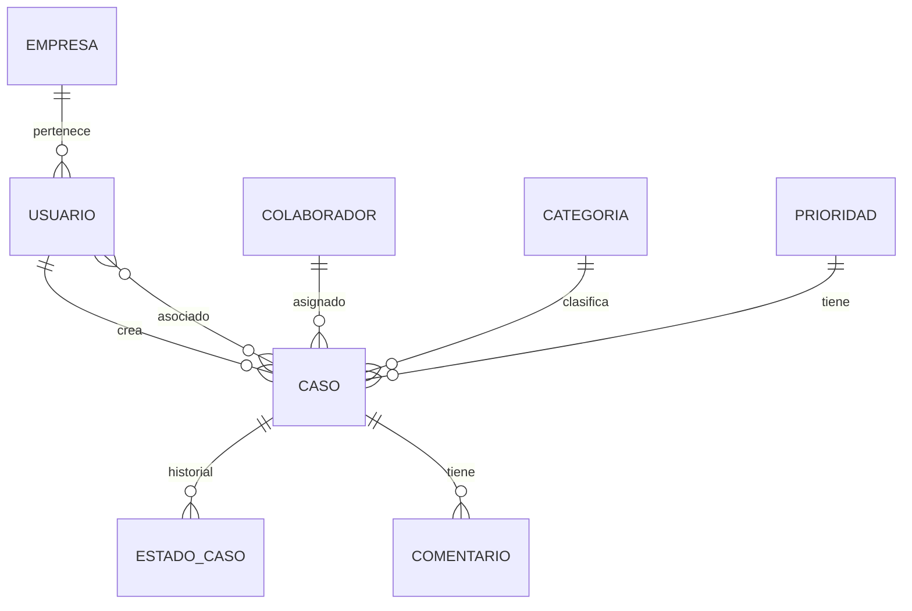

# Case Management API - NestJS

API RESTful para gestión de casos desarrollada con **NestJS**, **TypeORM** y **MySQL**. Una solución empresarial robusta y escalable.

## 🚀 Características

### **Framework y Tecnologías**
- ⚡ **NestJS** - Framework Node.js empresarial con TypeScript
- 🗄️ **TypeORM** - ORM avanzado con soporte completo para MySQL
- 🔐 **JWT & Passport** - Autenticación segura y guards personalizados  
- ✅ **Class Validator** - Validación robusta de DTOs
- 📚 **Swagger/OpenAPI** - Documentación automática interactiva
- 🐳 **Docker** - Containerización completa con docker-compose

### **Arquitectura Empresarial**
- 🏗️ **Modular** - Arquitectura basada en módulos de NestJS
- 🔄 **Dependency Injection** - IoC container nativo
- 🛡️ **Guards & Interceptors** - Seguridad y transformación de datos
- 📊 **Relaciones Complejas** - Asociaciones avanzadas con TypeORM
- 🎯 **DTOs Tipados** - Validación automática y documentación

### **Funcionalidades de Negocio**
- 👥 **Gestión Completa de Casos** - CRUD, estados, comentarios, asignaciones
- 📈 **Dashboard & Estadísticas** - Métricas en tiempo real
- 🔍 **Búsqueda Avanzada** - Filtros múltiples y paginación
- 📝 **Historial Completo** - Tracking de cambios de estado
- 🏢 **Multi-empresa** - Soporte para múltiples organizaciones

## 📋 Requisitos

- **Node.js** v16+ 
- **MySQL** 8.0+
- **npm** o **yarn**
- **Docker** (opcional)

## 🛠️ Instalación Rápida

### **Opción 1: Con Docker (Recomendado)**

```bash
# Clonar repositorio
git clone <repository-url>
cd case-management-nestjs

# Configurar variables de entorno
cp .env.example .env

# Iniciar servicios completos
docker-compose up -d

# Ver logs
docker-compose logs -f app
```

**¡Listo!** La API estará disponible en `http://localhost:3000`

### **Opción 2: Instalación Manual**

```bash
# Instalar dependencias
npm install

# Configurar base de datos
mysql -u root -p
CREATE DATABASE case_management_nest;

# Configurar .env
cp .env.example .env
# Editar .env con tus credenciales

# Iniciar en desarrollo
npm run start:dev

# Poblar datos de prueba
npm run seed
```

## 🎯 Endpoints Principales

### **Autenticación**
```bash
POST /api/v1/auth/login     # Iniciar sesión
POST /api/v1/auth/register  # Registrar usuario
```

### **Casos**
```bash
GET    /api/v1/casos                    # Listar con filtros
GET    /api/v1/casos/estadisticas      # Dashboard stats
GET    /api/v1/casos/:id               # Obtener caso específico
POST   /api/v1/casos                   # Crear caso
PATCH  /api/v1/casos/:id               # Actualizar caso
DELETE /api/v1/casos/:id               # Eliminar caso
PATCH  /api/v1/casos/:id/estado        # Cambiar estado
POST   /api/v1/casos/:id/comentarios   # Agregar comentario
```

### **Usuarios & Catálogos**
```bash
GET /api/v1/usuarios          # Gestión de usuarios
GET /api/v1/usuarios/profile  # Perfil actual
GET /api/v1/catalogs          # Todos los catálogos
GET /api/v1/catalogs/empresas # Empresas disponibles
```

## 📚 Documentación Interactiva

**Swagger UI**: `http://localhost:3000/api-docs`

- Documentación automática completa
- Interfaz interactiva para probar endpoints
- Schemas de request/response
- Autenticación JWT integrada

## 🔑 Usuarios de Prueba

Después de ejecutar `npm run seed`:

| Rol | Email | Contraseña | Descripción |
|-----|-------|------------|-------------|
| **Admin** | admin@demo.com | admin123 | Administrador completo |
| **Usuario** | user@demo.com | user123 | Usuario estándar |
| **Manager** | manager@demo.com | manager123 | Manager de empresa |

## 📊 Ejemplo de Uso

### **1. Autenticación**
```bash
curl -X POST http://localhost:3000/api/v1/auth/login \
  -H "Content-Type: application/json" \
  -d '{
    "correo": "admin@demo.com",
    "clave": "admin123"
  }'
```

**Respuesta:**
```json
{
  "message": "Login exitoso",
  "access_token": "eyJhbGciOiJIUzI1NiIsInR5cCI6IkpXVCJ9...",
  "usuario": {
    "id": 1,
    "nombre": "Administrador",
    "correo": "admin@demo.com",
    "empresa": { "id": 1, "nombre": "TechCorp Solutions" }
  }
}
```

### **2. Crear Caso**
```bash
curl -X POST http://localhost:3000/api/v1/casos \
  -H "Content-Type: application/json" \
  -H "Authorization: Bearer <tu-token>" \
  -d '{
    "titulo": "Error crítico en producción",
    "descripcion": "Sistema de pagos no funciona",
    "categoriaId": 1,
    "prioridadId": 4,
    "asignadoA": 1
  }'
```

### **3. Búsqueda Avanzada**
```bash
curl "http://localhost:3000/api/v1/casos?search=login&categoriaId=1&prioridadId=3&page=1&limit=10" \
  -H "Authorization: Bearer <tu-token>"
```
## 🔧 Scripts Disponibles

```bash
# Desarrollo
npm run start:dev          # Modo desarrollo con hot reload
npm run start:debug        # Modo debug

# Producción  
npm run build              # Compilar aplicación
npm run start:prod         # Ejecutar versión compilada

# Base de datos
npm run seed               # Poblar datos de prueba

# Testing
npm run test               # Unit tests
npm run test:e2e           # Tests end-to-end
npm run test:cov           # Coverage report

# Calidad de código
npm run lint               # ESLint
npm run format             # Prettier
```

## 🐳 Docker & Producción

### **Desarrollo con Docker**
```bash
# Servicios completos (API + MySQL + phpMyAdmin)
docker-compose up -d

# Solo base de datos
docker-compose up -d mysql

# Ver logs en vivo
docker-compose logs -f

# Ejecutar seed en container
docker-compose exec app npm run seed
```

### **Servicios Incluidos**
- **API NestJS**: `http://localhost:3000`
- **MySQL**: `localhost:3306`
- **phpMyAdmin**: `http://localhost:8080`
- **Swagger**: `http://localhost:3000/api-docs`

### **Variables de Entorno Producción**
```bash
NODE_ENV=production
DB_HOST=your-db-host
DB_USERNAME=your-db-user
DB_PASSWORD=your-secure-password
JWT_SECRET=your-super-secure-jwt-secret-key
```

## 🛡️ Seguridad

### **Implementadas**
- ✅ **JWT Authentication** con expiración configurable
- ✅ **Password Hashing** con bcrypt (rounds: 10)
- ✅ **Input Validation** con class-validator
- ✅ **CORS** configurado para desarrollo/producción
- ✅ **Helmet** - Security headers
- ✅ **Guards** para protección de rutas
- ✅ **SQL Injection** prevención con TypeORM

### **Recomendaciones Producción**
- 🔐 Configurar CORS con dominios específicos
- 🔑 Usar JWT_SECRET fuerte (256+ bits)
- 🛡️ Implementar rate limiting
- 📝 Configurar logging completo
- 🔍 Monitoreo con health checks

## 📊 Modelos de Datos

### **Relaciones Principales**



### **Entidades TypeORM**
- **Usuario**: Autenticación y datos personales
- **Empresa**: Multi-tenancy organizacional
- **Caso**: Entidad principal del negocio
- **Colaborador**: Asignación de responsables
- **Categoria/Prioridad**: Clasificación de casos
- **EstadoCaso**: Historial de cambios
- **Comentario**: Sistema de seguimiento
- **UsuarioCaso**: Relación many-to-many

## 🔍 Características Avanzadas

### **Búsqueda y Filtrado**
```typescript
// Ejemplo de query complejo
GET /api/v1/casos?search=error&categoriaId=1&prioridadId=3&page=2&limit=20
```

### **Estadísticas Dashboard**
```typescript
GET /api/v1/casos/estadisticas

// Respuesta incluye:
{
  "totalCasos": 150,
  "casosPorEstado": [...],
  "casosPorPrioridad": [...], 
  "casosPorCategoria": [...]
}
```

### **Gestión de Estados**
- Historial completo de cambios
- Tracking temporal automático
- Estados configurables por organización

## 🚀 Despliegue

### **Railway / Vercel**
```bash
# Configurar variables de entorno
railway login
railway add
railway deploy

# Variables necesarias:
# NODE_ENV=production
# DATABASE_URL=mysql://...
# JWT_SECRET=...
```

### **AWS / DigitalOcean**
```bash
# Dockerfile optimizado incluido
docker build -t case-management .
docker run -p 3000:3000 case-management
```

### **PM2 (Servidor tradicional)**
```bash
npm run build
pm2 start dist/main.js --name case-api
pm2 save
pm2 startup
```

## 🧪 Testing

### **Unit Tests**
```bash
npm run test
# Cobertura automática de servicios y controladores
```

### **E2E Tests**
```bash
npm run test:e2e
# Tests completos de endpoints con base de datos
```

### **Ejemplo Test**
```typescript
describe('CasosController (e2e)', () => {
  it('/casos (GET) should return paginated cases', () => {
    return request(app.getHttpServer())
      .get('/casos?page=1&limit=5')
      .set('Authorization', `Bearer ${authToken}`)
      .expect(200)
      .expect((res) => {
        expect(res.body.casos).toBeDefined();
        expect(res.body.total).toBeGreaterThan(0);
      });
  });
});
```

## 🛠️ Desarrollo

### **Comandos NestJS CLI**
```bash
# Generar módulo completo
nest g resource productos

# Generar servicio
nest g service users

# Generar controlador
nest g controller auth

# Generar guard
nest g guard auth/jwt-auth
```

### **Hot Reload**
Cambios automáticos en desarrollo sin reiniciar servidor.

### **Debugging**
```bash
npm run start:debug
# Debug port: 9229
```

## 📈 Performance

### **Optimizaciones Implementadas**
- ✅ **Query Optimization** - Joins eficientes con TypeORM
- ✅ **Pagination** - Limitación automática de resultados
- ✅ **Eager/Lazy Loading** - Carga optimizada de relaciones
- ✅ **Connection Pooling** - Pool de conexiones MySQL
- ✅ **Validation Caching** - Cache de validaciones DTOs

### **Métricas Desarrollo**
- **Startup time**: ~2-3 segundos
- **Memory usage**: ~150-200MB base
- **Response time**: <100ms promedio

## 🤝 Contribución

### **Convenciones de Código**
- **ESLint** + **Prettier** configurados
- **Conventional Commits** recomendados
- **TypeScript strict mode** habilitado
- **Swagger docs** obligatorio para endpoints

### **Pull Request Process**
1. Fork del proyecto
2. Crear feature branch: `git checkout -b feature/nueva-funcionalidad`
3. Commit changes: `git commit -m 'feat: agregar nueva funcionalidad'`
4. Push branch: `git push origin feature/nueva-funcionalidad`
5. Crear Pull Request con descripción detallada

## 🆘 Troubleshooting

### **Errores Comunes**

**Database connection failed**
```bash
# Verificar MySQL esté corriendo
brew services start mysql
# o
sudo systemctl start mysql

# Verificar credenciales en .env
```

**JWT token invalid**
```bash
# Verificar JWT_SECRET en .env
# Token expira en 24h por defecto
```

**Module not found**
```bash
# Reinstalar dependencias
rm -rf node_modules package-lock.json
npm install
```

### **Logs de Debug**
```bash
# Logs detallados en desarrollo
NODE_ENV=development npm run start:dev

# Logs de base de datos
# Activado automáticamente en desarrollo
```

## 📞 Soporte

- 📧 **Email**: tu-email@ejemplo.com
- 💬 **Issues**: GitHub Issues
- 📖 **Docs**: `/api-docs` endpoint
- 🔗 **Wiki**: Project Wiki

## 📄 Licencia

MIT License - ver [LICENSE.md](LICENSE.md)

---

## ⭐ Características Destacadas de NestJS

- 🏗️ **Arquitectura Modular** - Escalabilidad empresarial
- 💉 **Dependency Injection** - Testeable y mantenible  
- 🔒 **Guards & Interceptors** - Seguridad de nivel enterprise
- 📚 **Swagger Auto-generation** - Documentación automática
- 🧪 **Testing First** - Framework orientado a testing
- 🚀 **Performance** - Optimizado para alta concurrencia

**¡Gracias por usar Case Management API con NestJS!** 🚀

---
*Desarrollado con ❤️ usando NestJS, TypeORM y las mejores prácticas de desarrollo.*